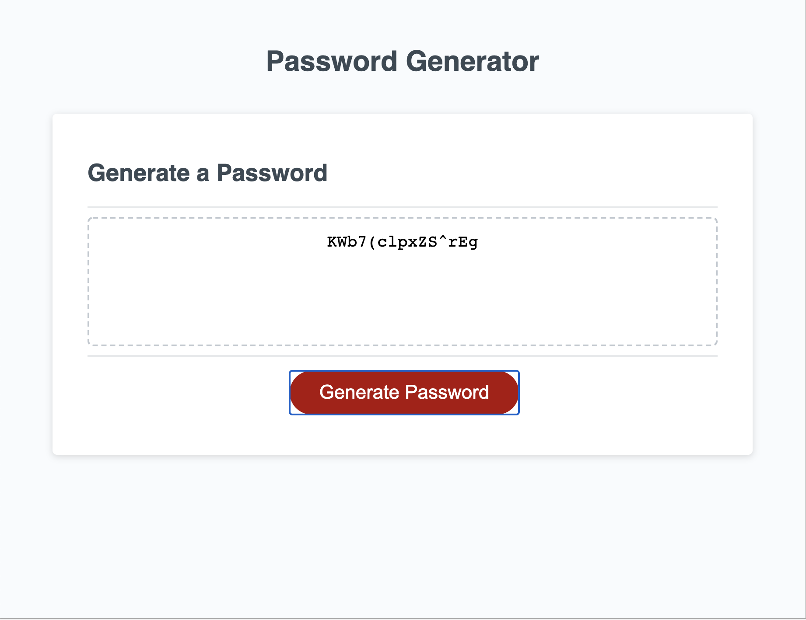

# javascript-password-generator

This application generates a randomized password based on user inputs such as whether or not they want lower case, upper case, special characters, and numbers to be used, and the length of the password. The application was developed using a combination of HTMl, Javascript, and CSS. Please see below for screenshots of the site. 

